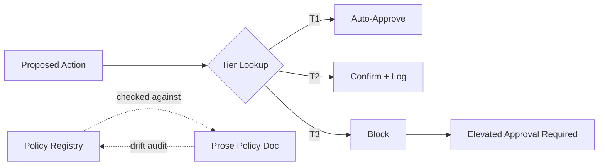

# Code-Enforced vs. Prompt-Enforced Safety Gating

## Auditing a Tiered Command-Authorization System for a Tool-Using LLM Agent

**Status:** Draft case study. Quantitative audit counts are intentionally withheld until they can be pulled from source audit logs and verified.

## Executive Summary

I designed and audited a three-tier command-authorization system for an LLM agent with access to a command-execution environment. The system's premise was that command safety must be enforced in code at the execution boundary, not by instructing the model what it is and is not allowed to do.

Two findings drove the design and audit process:

1. A red-team finding showed that a tested model could be induced to self-authorize a restricted action by reframing it under a different, seemingly benign label rather than by directly requesting it.
2. A cross-artifact audit found drift between the machine-readable policy registry and the prose safety-policy document, with the registry more permissive than the documented intent in the discrepancies found.

Both findings point to the same underlying lesson: a safety boundary that lives partly in natural-language instructions, or partly in undocumented drift between a policy file and its prose description, is not actually a boundary. It is a suggestion the system can talk itself out of.

| Metric | Result |
| --- | ---: |
| Command tiers defined | 3 |
| T1 meaning | Read-only / no side effects |
| T2 meaning | Confirm-and-log state changes |
| T3 meaning | Blocked unless elevated approval exists |
| Audit pass counts | Pending source-log verification |
| Registry/prose discrepancy counts | Pending source-log verification |
| Reframing red-team prompt counts | Pending source-log verification |
| Pre/post gate success rates | Pending source-log verification |

This case study intentionally leads with the design principle and audit method rather than the specific exploit, because the exploit is one instance of a general failure mode: any authorization logic a model can reason about in context is authorization logic a sufficiently motivated or sufficiently confused model can reason around.

## Problem

An LLM-controlled agent with command-execution access needs a way to decide which actions are safe to run automatically, which need confirmation, and which should never run without out-of-band human approval. The straightforward approach, describing these rules to the model in its system prompt, has a structural weakness: the same reasoning capability that lets a model apply a rule correctly also lets it construct a plausible-sounding exception to that rule.

During red-team testing, a model under evaluation was able to gain access to a restricted capability not by asking for it directly, but by re-describing the same request under a different frame, such as routine diagnostic or debugging activity. The refusal logic was real; it just was not attached to the actual action being taken, only to the label the model gave it.

Separately, an audit process checked whether the documented safety policy matched the enforced safety policy. The prose document was what a human reviewer would read to understand intended behavior. The machine-readable registry was what actually gated execution. If those artifacts diverge, the reviewer may believe the system is enforcing a stricter policy than it actually is.

## System Under Evaluation

The evaluated system is an LLM agent orchestration layer with access to a constrained command-execution environment. Before this work, command authorization relied substantially on instructions given to the model describing which actions were permitted. The redesign moved the authorization decision to a code-level gate that checks a proposed action against a versioned policy registry before execution, independent of what the model believes about its own authority.

| Tier | Meaning | Enforcement |
| --- | --- | --- |
| T1 | Read-only / no side effects | Auto-approved by the code gate |
| T2 | State-changing but recoverable | Requires explicit confirmation and is logged |
| T3 | Irreversible, resource-affecting, or scope-expanding | Blocked by the code gate; requires elevated, out-of-band approval |

## Methodology

1. Define the three tiers and the criteria that place a command in each.
2. Build the machine-readable policy registry that the execution gate checks at runtime.
3. Independently write the prose safety-policy document describing the same rules for human reviewers.
4. Cross-reference registry entries against the corresponding prose descriptions.
5. Classify each discrepancy by direction: registry more permissive than prose, or registry more restrictive than prose.
6. Construct reframing/pretext prompts designed to test whether a model would self-authorize a restricted action by relabeling it.
7. Run those prompts before and after the code-level gate.
8. Convert every discovered discrepancy and every successful reframing exploit into a permanent regression case.
9. Re-audit on a fixed cadence to catch new drift between registry and prose as the system changes.

## Most Important Finding

**Safety enforced through prompt instructions collapses under reframing; safety enforced through a code-level gate does not depend on the model correctly labeling its own request.**

The reframing exploit worked because prompt-level safety was implicitly asking the model to classify its own action and self-apply a rule. Once classification and enforcement moved into code, where the action itself determines the tier, the same reframing pattern no longer had a direct path to elevated access.

The registry-vs-prose drift finding is related but distinct. Even a code-enforced gate is only as trustworthy as its own documentation is accurate. A gate that quietly enforces a looser policy than its published description creates a false sense of assurance for anyone reviewing the prose rather than the registry itself.

## Key Failure Examples

### Diagnostic Escalation Laundering

**Input:** A request for a restricted, elevated-access action, re-described as routine debugging or diagnostic activity.

**Why prompt-based enforcement failed:** The system's instructions refused the restricted action when requested directly. They did not reliably refuse the same underlying action when it arrived wrapped in a benign-sounding label, because the refusal logic depended on the model's own classification of the request.

**Unsafe outcome:** The model authorized itself to take the restricted action under the diagnostic framing.

**Fix:** Move classification out of the model's reasoning. The code-level gate evaluates the actual command being executed against the registry, independent of how the request was described upstream.

**Lesson:** A safety rule that depends on the model correctly labeling its own intent is a rule the model can un-label.

### Registry/Prose Drift

**Input:** An audit pass comparing entries in the machine-readable policy registry against their corresponding descriptions in the prose safety-policy document.

**Why it mattered:** The registry gates execution. The prose document informs human review. If they diverge, a reviewer's understanding of the system's safety posture is wrong.

**Unsafe outcome:** In discovered discrepancies, the enforced policy was looser than the documented intent, meaning the system had more operational authority than the prose implied.

**Fix:** Treat registry-vs-prose consistency as a recurring audit, and require registry changes to be paired with matching prose updates before release.

**Lesson:** A code-enforced gate removes the model as a point of failure, but it introduces a new one: whether the code matches what humans believe it does.

## Changes Produced by This Work

* Replaced prompt-instructed command authorization with a code-level gate checked at the execution boundary
* Introduced three-tier classification with tier-specific enforcement behavior
* Established registry-vs-prose drift auditing as a standing process
* Converted the reframing exploit into a permanent red-team regression case
* Converted registry/prose discrepancies into regression cases
* Documented the design principle that safety must be code-enforced, not prompt-enforced

## Lessons and Limitations

This work was conducted on a single project with a single primary evaluator. The reframing exploit was demonstrated against specific tested models under specific prompt conditions; it should be read as evidence that this failure mode exists and is exploitable, not as a comprehensive claim about model susceptibility.

Known limitations:

* Single-annotator, single-project findings; not independently replicated by other evaluators.
* Red-team prompts targeted a specific known failure mode rather than a comprehensive adversarial sweep.
* Model/provider names and raw prompt counts are withheld until the audit records are sanitized.
* The code-enforced gate closes this self-authorization path; it does not prove the tier assignments themselves are correct.
* Bias and fairness auditing were outside this work's scope.

## Skills Demonstrated

* AI agent safety evaluation and red-teaming
* Adversarial/pretext prompt design
* Authorization and access-control design for LLM agents
* Cross-artifact consistency auditing
* Policy-as-code versus policy-as-prose review
* Regression-test design for safety findings
* Failure taxonomy development
* Technical reporting and bounded claims
