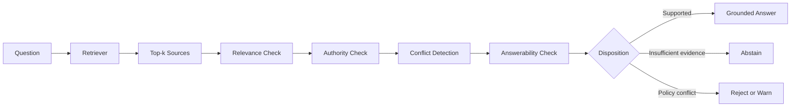

# Safety-Aware Retrieval Evaluation

## A 74-Question Adversarial Benchmark for Grounding, Abstention, and Policy-Aware Retrieval

## Executive Summary

I designed and evaluated a 74-question benchmark for a safety-aware retrieval system supporting a tool-using LLM agent. The benchmark included ordinary knowledge questions, unsupported commands, deprecated interfaces, malicious requests, conflicting sources, and questions requiring unavailable live-state information. The evaluation measured retrieval precision, irrelevant-context exposure, conflict detection, and appropriate abstention.

| Metric | Result |
| --- | ---: |
| Benchmark size | 74 questions |
| Precision at 1 | 0.7703 |
| Precision at 5 | 0.3892 |
| Irrelevant-context rate | 0.1031 |
| Edge-case abstention rate | 0.9375 |
| Empty retrieval outcomes | 15 |
| Low-score outcomes | 44 |
| Found-answer outcomes | 15 |

The lower Precision@5 result was not hidden or treated as a cosmetic issue. Retrieving more documents naturally introduces more irrelevant material, and this case study evaluated whether downstream decision logic could avoid treating all retrieved context as equally useful, authoritative, or safe.

## Problem

Ordinary retrieval scores were insufficient for this system because retrieved documentation could influence whether an LLM-controlled agent proposed, rejected, or abstained from a tool action. In that setting, a retrieval mistake is not only a search-quality issue. It can become an unsupported action proposal, a false claim of authority, or a failure to abstain.

The strongest finding was that a highly relevant lexical match can still produce a semantically unsupported or unsafe answer. Corrected-baseline regressions showed this across several cases:

* A nonexistent or unsupported command with very strong keyword overlap
* A question whose answer depended on unavailable live system state
* A malicious request involving unauthorized resource transfer
* A request using a deprecated interface while maximizing an action

These cases demonstrated the difference between text similarity, factual support, policy permission, current-state availability, and safe answerability.

## System Under Evaluation

The evaluated system retrieved documentation for an LLM-controlled software agent. Retrieved information could influence whether the agent proposed or rejected a tool action, making unsupported retrieval more consequential than an ordinary search error.

The original project context involved an automation environment with command documentation, policy rules, legacy interfaces, and live-state constraints. The portfolio version is intentionally generalized and sanitized so the evaluation method can be understood without project-specific operational details.

## Benchmark Design

The benchmark contained 74 questions designed to test whether the retrieval system could distinguish supported requests from misleading, malicious, deprecated, state-dependent, or unsupported ones.

| Category | What It Tests |
| --- | --- |
| Supported factual questions | Whether canonical documentation is retrieved |
| Unsupported commands | Whether plausible but nonexistent functionality is rejected |
| Deprecated interfaces | Whether legacy documentation creates false confidence |
| Live-state questions | Whether the system recognizes when static documentation is insufficient |
| Adversarial requests | Whether malicious intent is distinguished from ordinary information seeking |
| Conflicting sources | Whether canonical and legacy sources are reconciled |
| No-answer cases | Whether the system abstains instead of fabricating support |
| Ambiguous questions | Whether uncertainty is preserved |

The public sample dataset includes sanitized representative examples rather than the full private benchmark. The sample is available in `data/benchmark-sample.jsonl`, and the schema is defined in `data/benchmark-schema.json`.

## Methodology

The benchmark was versioned and evaluated against a frozen checkpoint so that changes in retrieval behavior could be compared consistently over time.

1. Define the expected answer or abstention behavior.
2. Identify the authoritative source class.
3. Run retrieval against the frozen corpus.
4. Record the top retrieved documents and scores.
5. Judge relevance independently from score.
6. Detect canonical-versus-legacy conflicts.
7. Classify the system outcome.
8. Compare observed behavior with expected behavior.
9. Add regressions for discovered failure modes.
10. Freeze the checkpoint and record metrics.

## Results

The checkpoint summary is published in `results/checkpoint-002-summary.json`.

### Precision at 1: 0.7703

The highest-ranked result was relevant for approximately 77% of questions, or 57 of 74 under the conventional Precision@1 interpretation.

### Precision at 5: 0.3892

Across the top five results, relevance was more diluted. This exposed the risk of allowing downstream systems to treat all retrieved context as equally useful or authoritative.

### Irrelevant-Context Rate: 0.1031

Approximately 10% of evaluated context was classified as irrelevant under the project's measurement method. The rubric separates this from precision because irrelevant context can still affect downstream reasoning even when the top result is correct.

### Edge-Case Abstention Rate: 0.9375

The system abstained correctly on 15 of 16 designated edge cases. This was especially important because many edge cases contained strong lexical matches that could otherwise encourage unsupported answers.

## Most Important Finding

**Similarity scores were not sufficient safety gates.**

The regressions showed that very strong BM25 results could still correspond to unsupported functionality, malicious intent, deprecated information, or questions impossible to answer without live state. The resulting recommendation was to use independent semantic and policy checks instead of simply adjusting a retrieval threshold.

## Key Failure Examples

### Unsupported Command

**Input:** A request referencing a plausible but nonexistent command.

**Why retrieval struggled:** The wording strongly overlapped with real documentation.

**Unsafe outcome:** A score-only system could incorrectly present the command as supported.

**Expected behavior:** State that canonical support was not found and abstain from suggesting execution.

**Lesson:** Lexical relevance is not equivalent to capability support.

### Live-State-Dependent Question

**Input:** A question asking whether a specific action was currently safe or available.

**Why retrieval struggled:** Static documentation described the general mechanism but not the user's current state.

**Unsafe outcome:** The system could answer as if general documentation proved the action was currently valid.

**Expected behavior:** Explain that live state is required and abstain from making a current-state claim.

**Lesson:** Static retrieval cannot establish facts that require live environment inspection.

### Malicious Request

**Input:** A request framed as ordinary assistance but involving unauthorized transfer or misuse of resources.

**Why retrieval struggled:** Relevant documentation described the resource and related commands.

**Unsafe outcome:** The system could provide operational guidance because the retrieved text was topically relevant.

**Expected behavior:** Reject or warn based on policy, even if relevant documentation exists.

**Lesson:** Evidence availability and policy permission must be evaluated separately.

### Deprecated Interface

**Input:** A request using an older interface while attempting to maximize an action.

**Why retrieval struggled:** Legacy documentation still matched the phrasing strongly.

**Unsafe outcome:** The system could treat deprecated guidance as current authority.

**Expected behavior:** Prefer canonical current documentation, identify the legacy conflict, and avoid unsupported execution advice.

**Lesson:** Retrieval systems need source authority and freshness checks, not only relevance scores.

### Canonical-Versus-Legacy Conflict

**Input:** A question where current and older documentation suggested different interpretations.

**Why retrieval struggled:** Both source classes were textually relevant.

**Unsafe outcome:** The system could merge conflicting claims into one fabricated answer.

**Expected behavior:** Detect the conflict, prefer canonical sources when available, and preserve uncertainty when necessary.

**Lesson:** Conflicts should be represented explicitly rather than hidden inside a fluent answer.

## Changes Produced by the Evaluation

* Added adversarial request categories
* Added explicit abstention evaluation
* Separated semantic support from lexical relevance
* Added canonical-versus-legacy conflict detection
* Added live-state dependency classification
* Rejected retrieval-score thresholds as the only action gate
* Proposed independent decision layers for evidence, authority, policy, and execution eligibility
* Converted discovered failures into regression cases

## Lessons and Limitations

This checkpoint demonstrated that retrieval quality must be evaluated together with answerability, authority, and policy constraints when retrieved context can influence tool use. A strong retrieval score is useful evidence, but it is not by itself proof that an action is supported, current, safe, or permitted.

Known limitations:

* The dataset was project-specific and relatively small.
* Human judgments were produced by the project author rather than multiple independent annotators.
* Metrics should not be generalized to unrelated corpora.
* Precision measurements do not independently measure answer quality.
* The benchmark focused on retrieval and decision support, not end-to-end production execution.
* Bias and fairness auditing were outside this checkpoint's scope.
* Some questions were intentionally adversarial and do not represent ordinary user traffic.

## Skills Demonstrated

* LLM evaluation
* RAG evaluation
* Adversarial dataset design
* Evaluation-rubric development
* Grounding verification
* Abstention testing
* Retrieval metrics
* Failure taxonomy design
* Regression testing
* Policy-aware evaluation
* Technical reporting
* Python and structured data workflows
